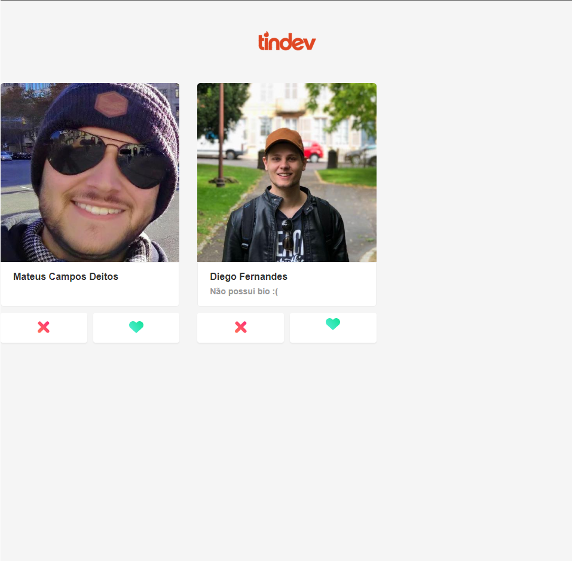

<h1 align="center">
  Tindev Application
  
  
</h1>

 - 
 - 
 - 
## Description
  - Application developed for web/mobile during the Omnistack Week 8th edition (event promoted by Rocketseat).

## Web 💻

  
  
  

## Mobile 📱

  

## Knowledges 🚀
 - Building the backend using node.js
 - Creating routes to fetch data from the backend
 - Building front-end using ReactJS
 - Creating routes to handle page redirection
 - Handling with data fetched from the backend
 - Building mobile using ReactNative
 - Using MongoDB database to store data.
 - Using mongoose to communicate with MongoDB
 - Using async-storage to store data from the current user session in the mobile app
 - Using GitHub API to fetch data

## Credits 👏
  - <a target="_blank" href="https://rocketseat.com.br">Rocketseat</a>

## Contact ✉
  - <a target="_blank" href="https://www.linkedin.com/in/mateus-campos-deitos-42688864//">LinkedIn</a>
  - <a target="_blank" href="mailto:matdeitos@gmail.com">E-mail</a>
